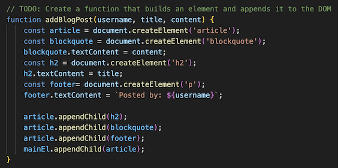
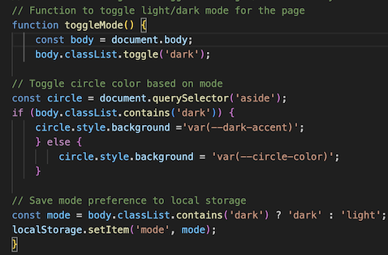
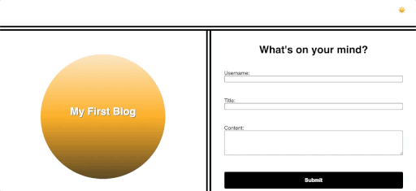

# Homework-Challenge-4

## Technologies Used

HTML, CSS and JavaScript

## Description

A two-page website where users will input and view blog posts. It includes building a content form, dynamically rendering blog posts, and implementing a light/dark mode toggle.

## Usage

1. Launch the blog post webpage.

2. Enter username, title of your post and content in their respective fields.

3. Click "Submit" button and view your blog post on the next page.

4. If you want to add another post, click the "Back" button in the top right corner of the page which will take you back to the landing page. Repeat Step 2 and 3.

5. Toggle light mode/dark mode by clicking the switch "sun emoji" in the top right corner of the page to match your preference and reading mood.

## Code Snippet

A function to create elements in the blog and append to DOM.

A function to create logic to toggle light mode/dark mode for the page and circle.

## Gif Demo

## Author Info

[Portfolio] (https://asgithub11.github.io/Homework-Challenge-2/)

[Github] (https://github.com/ASgithub11)

[LinkedIn] (https://www.linkedin.com/in/aisha-siddiqa-726578311/)

## License

MIT License

Copyright (c) 2024 MIT

Permission is hereby granted, free of charge, to any person obtaining a copy of this software and associated documentation files (the "Software"), to deal in the Software without restriction, including without limitation the rights to use, copy, modify, merge, publish, distribute, sublicense, and/or sell copies of the Software, and to permit persons to whom the Software is furnished to do so, subject to the following conditions:

The above copyright notice and this permission notice shall be included in all copies or substantial portions of the Software.

THE SOFTWARE IS PROVIDED "AS IS", WITHOUT WARRANTY OF ANY KIND, EXPRESS OR IMPLIED, INCLUDING BUT NOT LIMITED TO THE WARRANTIES OF MERCHANTABILITY, FITNESS FOR A PARTICULAR PURPOSE AND NONINFRINGEMENT. IN NO EVENT SHALL THE AUTHORS OR COPYRIGHT HOLDERS BE LIABLE FOR ANY CLAIM, DAMAGES OR OTHER LIABILITY, WHETHER IN AN ACTION OF CONTRACT, TORT OR OTHERWISE, ARISING FROM, OUT OF OR IN CONNECTION WITH THE SOFTWARE OR THE USE OR OTHER DEALINGS IN THE SOFTWARE.

## Credits

N/A

## Badges

N/A

## Features

N/A

## Contributing

N/A

## Tests

N/A
